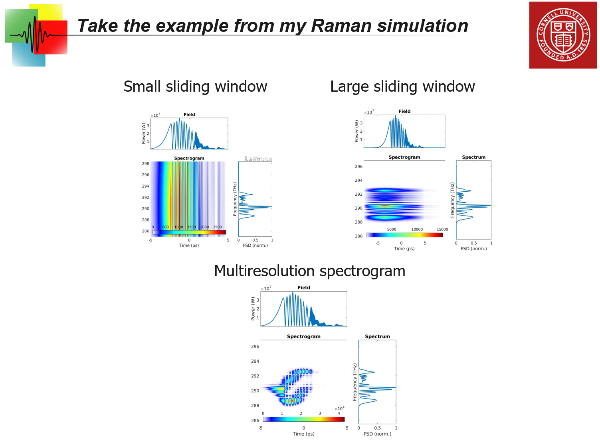
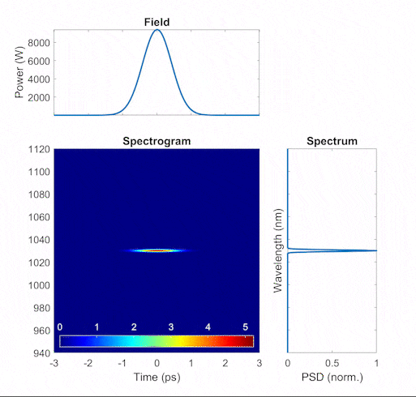
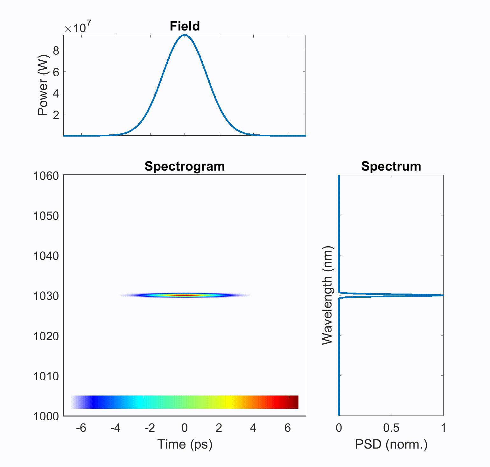
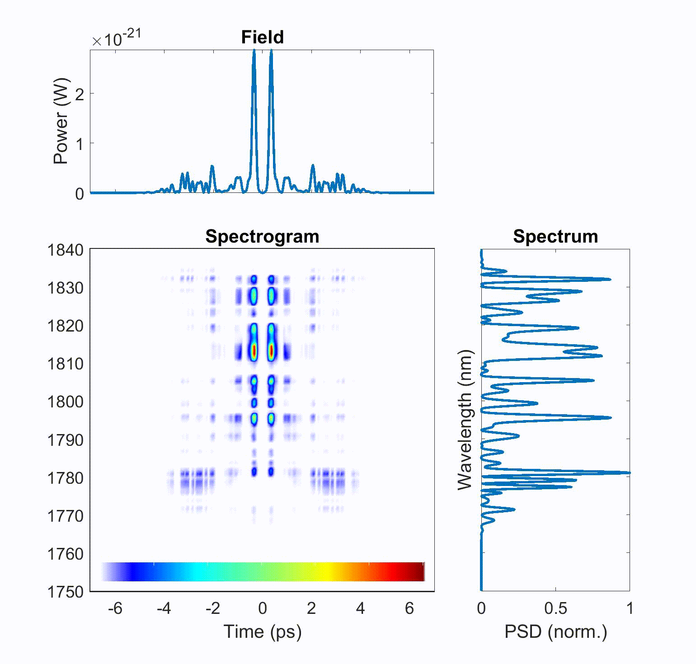

# High-resolution Spectrogram
This is the shared code to compute the high-resolution spectrogram with MATLAB.

Spectrogram is useful for visualizing the time-frequency relation of a field.

## Introduction and Motivation
Due to the uncertainty principle, a single spectrogram is subject to counterbalance between temporal and spectral resolutions. With a small sliding time window to get a good temporal resolution, spectral resolution is lost; with a large time window for a good spectral resolution, temporal resolution is lost. However, there is a solution to this problem by combining multiple spectrograms with different time windows. Please see details in the attached slide `061421 - spectrogram demo.pptx`. For more details about the implementation, please see comments in the MATLAB code. This function is also within my other shared packages for pulse propagation, but I'd like to mention it again in this separate GitHub repository due to its fundamental importance.  

## References (our papers):
1. [Raman scattering](https://doi.org/10.1063/5.0189749)

## Demonstrations:
- **Dispersion stretching**  
As the pulse propagates in a dispersive medium, it acquires dispersion that temporally stretches the pulse.  

- **Self-phase modulation (SPM)**  
As the pulse propagates with a dominant third-order nonlinearity, it acquires a nonlinear phase that spectrally broadens a pulse, creating new frequencies.  

- **Raman-Stokes pulse compression**  
During Stokes generation in the "transient" Raman regime, the SPM phase of a pump pulse can be copied to the Stokes pulse during nonlinear evolution. Therefore, the generated Stokes pulse, as the pump pulse, eventually can be dechirped to a duration shorter than the initially-injected pump pulse ([[1]](#references-our-papers)). Below are spectrograms of the pump (left) and Stokes (right) fields. We can see a "hole" in the pump field as this part is converted to the Stokes field.  
